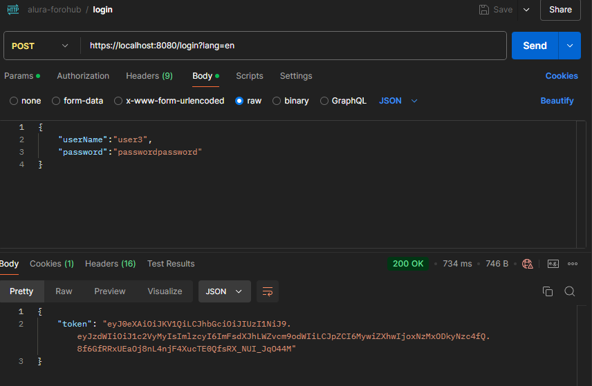

# Alura-ForoHUB


Simple Rest API for a forum using java spring boot 3

This project is part of the Alura One Next Education program.

## Dependencies

To run this project you need a running installation of postgresSQL 15

## Installation

In order to run this application you should follow this steps

### Clone the source code:

```sh
git clone https://github.com/jmortegaf/alura-challenge2.git
```

### cd into the project folder:

```sh
cd alura-challenge2
```

### Set the environment varibles in the application.properties file inside the ``````resources`````` directory:

### Put the ssl certificate in the `````resources````` directory.

This API uses HTTPs, so you'll need to obtain a valid ssl certificate, you can obteain this using a service like letsencrypt.
if you're using certbot to get your certificate you'll need to convert the fullchain.pem and privkey.pem to a .p12 certificate using:

````
openssl pkcs12 -export \
-in /etc/letsencrypt/live/your-domain.com/fullchain.pem \
-inkey /etc/letsencrypt/live/your-domain.com/privkey.pem \
-out keystore.p12 \
-name your-alias \
-password pass:your-password
`````

### Run the project from the IDE

## Usage Examples

The API counts with the following endpoints

### Register User
You can register a new user in the  `````/register````` endpoint, which takes a 
request body with the username, email and password. Both the username and email must be unique.

````
{
    "userName":"your-username",
    "email":"your-email",
    "password":"your-password"
}
````


### Login
The endpoint `````/login````` takes a request body with the username and password. The request response has a body
with the jwt authentication token. 

````
{
    "userName":"your-username",
    "password":"your-password"
}
````


### Create new thread
You can create a new thread using the ````/threads```` endpoint with the `````POST````` method.
The request needs a body with the thread title and message, both of which should be unique.
In case they aren't the server will respond with the appropriate error message.
````
{
    "title":"Unique thread title",
    "message":"Unique thread message"
}
````


### Swagger
This project also includes the use of the Swagger OpenAPI tools that allow the user 
to easily interact and understand the different endpoint that the API offers.
To see the Swagger interface you can visit:
``````https://localhost:8080/swagger-ui/index.html``````


